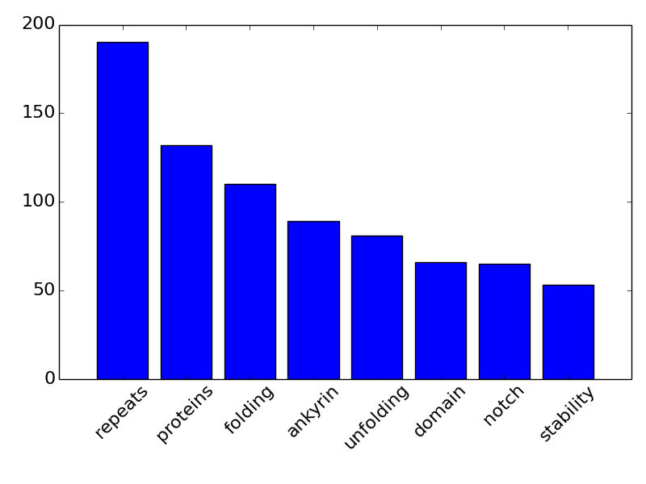
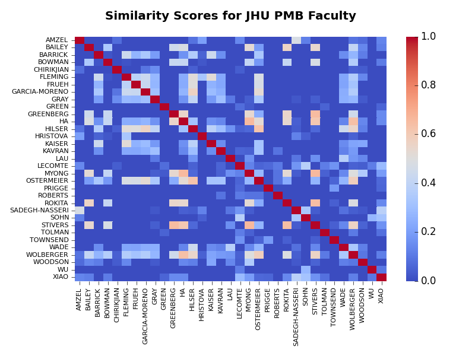

# Mining NIH Research Abstracts and Determining Research Similarities
by Matt Stetz 2018

## Introduction
The wordfreq script scrapes the NIH database of published research abstracts and identifies keywords that define a researcher's corpus of published data. Keywords are identified by comparing term frequency (TF) values.

Once TFs are known, you can run the cosine_calc script to determine the cosine similarity among all researcheres in a network

There are two scripts included in this repo:
* wordfreq.py : scrapes and mines NIH NCBI PubMed database
* cosinecalc.py : calculates cosine similarity for network analysis

## Requirements
You need the following libraries:
* biopython
* elementtree
* numpy
* pylab/matplotlib
* seaborn

## Execution
The key input from the user is a .txt file that lists the names of the researchers you wish to analyze in NCBI format. This should look like:

###### Smith J
###### Nguyen C
###### Lee JY
###### Jones MM
###### ...
###### Chen Z

You can also include additional NCBI search terms, for example:

###### Stetz MA AND University of Pennsylvania[ad]

There is also a list of trivial words that must be included 'trivial.txt' This file is similar to the english "stop words" used in sci-kit learn. I wrote all of the cleaning/munging functions myself for determining TFs so I included my own list of words to exclude.

First fill out the the user-specified data directories in wordfreq then run that script. After that run cosine_calc (you do not need to specifiy anything).

## Example Results
Two files are generated by wordfreq for each author analyzed:

* A bar plot showing the author's highest TFs (default is 10 highest TFs). An example is shown below:

* An example correlation matrix for an entire network of scientists is shown below (network is the Biophysics Department at Johns Hopkins):

* The entire output from the Johns Hopkins example is provided in the JHU_TEST directory.
